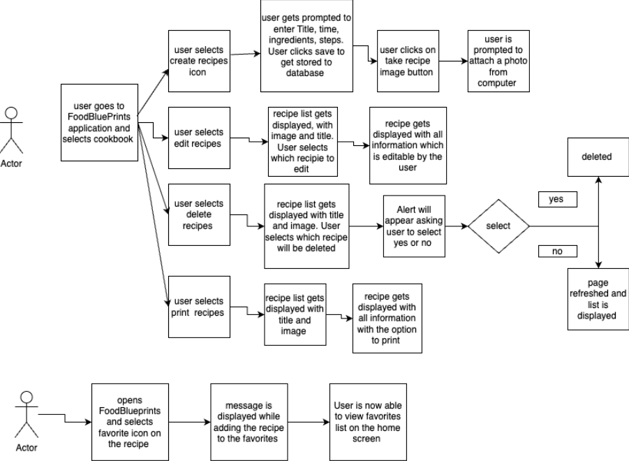
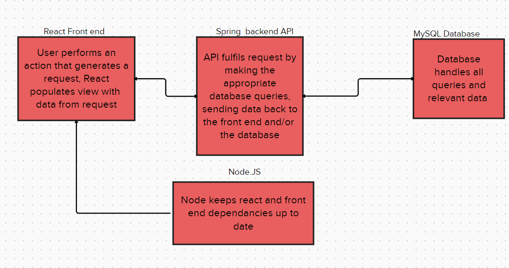

# **FoodBlueprints**
## **Share your recipes painlessly**
The purpose of FoodBlueprints is to create an online place where users can share their personal recipes. The ultimate objective of this web application is to facilitate mindlessly-easy recipe sharing

## **Why do we care?**
We recognize that a large number of people lack recipes to cook with, and another large number of people have recipes they have no way to share. We want to increase the shareability and accessibility of recipes. We believe it is important to solve these problems so that people can eat better, share their culture through food, and make the world a less-hungry place. 

## **Who is this for?**
The primary audience of this web application is college students between the ages of 18-25. They are very busy, so they need to be able to easily find recipes, save recipes they want for later, and have a large number of recipes that are cheap to make. We know that many people in this demographic are college students, who value cheap, accessible, and healthy meals. We are looking to increase their ability to obtain these meals and recipes. 

## **Software Requirements**
### **Functional**
The functional requirements of our web application would include but are not limited to adding recipes, editing recipes, deleting recipes, setting favorite recipes, and printing recipes. Adding recipes will allow you to share your personal recipes with others. Editing recipes will allow you to alter your existing recipes you have on your account. Deleting recipes will allow you to get rid of recipes you no longer want to share. Setting your favorite recipes will allow you to mark specific recipes you find notable and save them to a more quickly accessible area. Printing recipes will allow you to transform the digital recipe into a physical copy.  

### **Non-functional**
Non-functional requirements include performance, reliability, and security. We want the application to be performant and fast enough so that the users don’t have to wait. Increasing Reliability also comes to the forefront as we always want our users to have access to their recipes whenever they get hungry. As we also want to ensure that our application is secure, we plan on testing out our application for security vulnerabilities and implementing Spring security into our application.

## **Software Architecture**
For our software, we are creating our application database with SQL and connecting it to a Spring backend. We will manage client side views using ReactJS, and Node to manage dependencies.

## **Technology Stack**
SQL  
Spring Boot  
Spring Security  
Node  
React  

We will use SQL for all of our database needs. We will be using the Spring framework for the backend of our application. We will use Spring Boot for configuration and Spring Security for dealing with login and remediating vulnerabilities. Node and React will be used for our front-end. 

## **Meet the Team**
**Joey Parker** - Chief Recipe Sourcer (CRS)  
**Jonathan Dew**   
**Daniel Seamon**  
**Elijah Ingram** - Front End Developer  
**Zachary Palko** - Chief Security Officer (CSO) & Backend Developer
